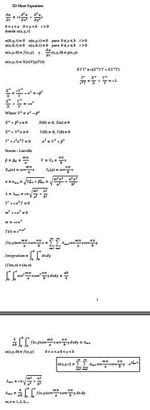
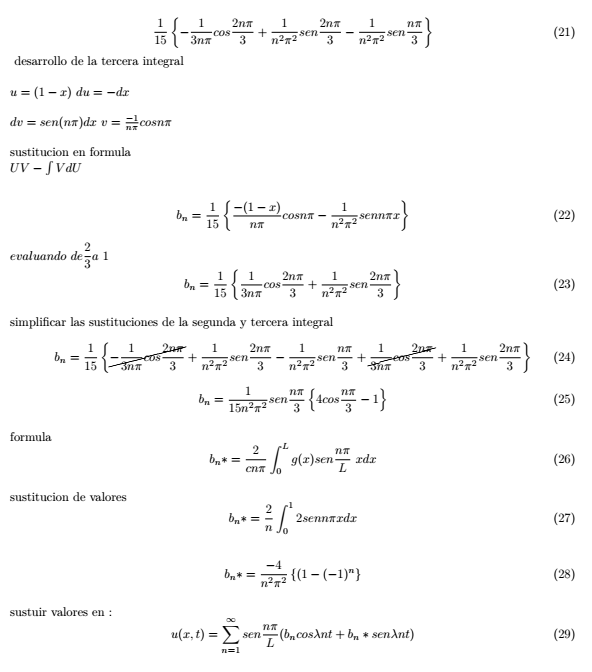
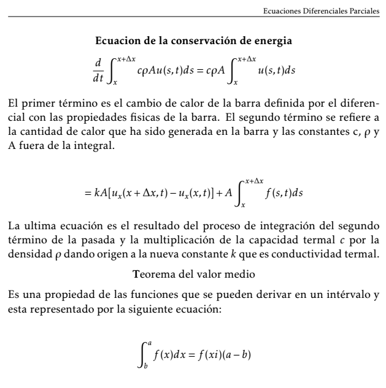
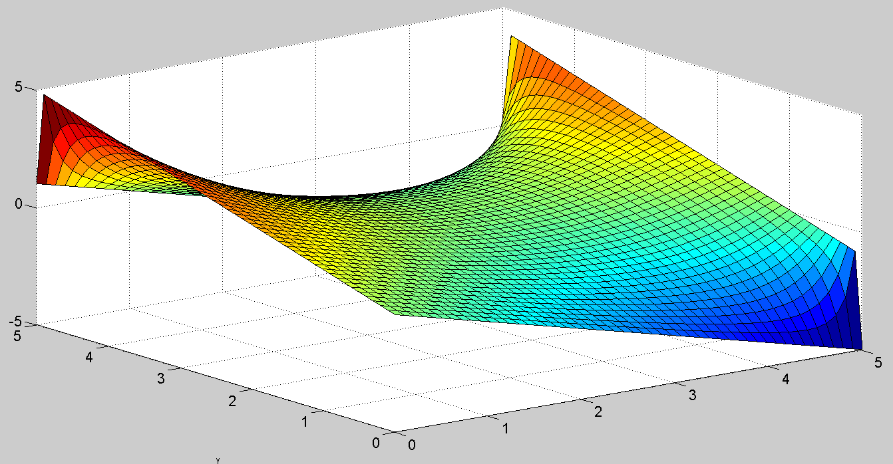
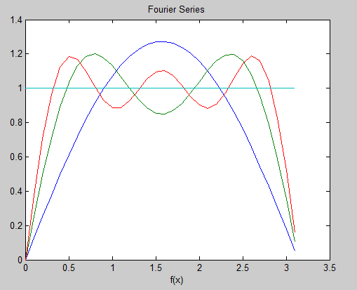
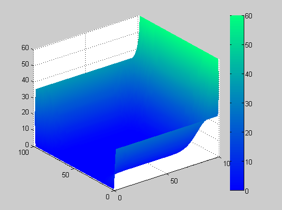

# Partial-Differential-Equations
## PDE course .tex and matlab files
Part of my engineering PDE class was to create .tex files to explain basic lectures and theory about PDE and matlab numerical methods on how to solve them.
This repository is disorganized at a certain extension but the .m and .tex codes are running properly.

### - This is one of my first .tex documents just to practice math notation.

### - Some math expressions properly listed and documented.

### - You will find some PDE lectures as well that explains the theory in spanish.

  

The matlab files contains as well some numerical methods that solve Differential Equations common problems.
  
### - Finite difference method solution in matlab.

  
### - Fourier series plot.

  
### - Gauss Seidel numerical method with variable number of iterations and constant frontier border .

  
  
  
  
